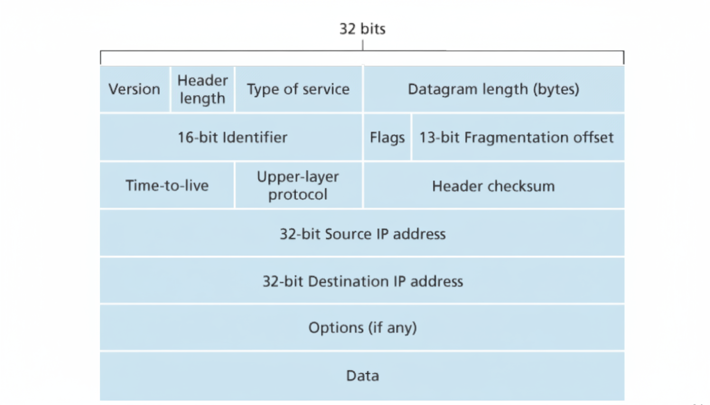

# network layer

## IPv4 헤더 구조

- 버전
  - IP 프로토콜의 버전을 명시함. IPv4, IPv6
- 헤더 길이
  - 실제 페이로드가 시작하는 곳을 결정함. 가변 길이의 옵션이 있기 때문에 필요한 값이다.
  - 옵션이 없으면 20 바이트이다.
- 서비스 타입
  - 패킷의 종류와 우선순위를 구별해서 QOS를 관리할 때 사용되는 값이다.	
- 데이터 그램 길이
  - IP 패킷의 전체 길이. 바이트 단위이다.
- 식별자, 플래그, 단편화 오프셋
  - 단편화와 관련된 필드들. 추후 설명
- TTL
  - 라우터를 지나갈 때마다 하나씩 감소하고 0이 되면 패킷을 버린다. 패킷의 수명을 정한 값이다.
- 프로토콜
  - 전송 계층의 특정 프로토콜을 명시한다. 네트워크 계층과 전송 계층을 연결하는 역할을 한다.
- 헤더 체크섬
  - 패킷의 비트 오류를 탐지하는데 사용되는 값. 
- 출발지와 목적지 IP 주소
  - 말 그대로 출발지와 목적지의 IP 주소를 저장하는 공간
- 옵션
  - 헤더가 가변 길이로 변하는 문제와 옵션에 따라 라우터에서의 처리 시간이 크게 달라지는 문제 때문에 거의 사용하지 않는다.
  - IPv6에서는 포함되지 않는 값이다.
- 데이터(페이로드)
  - 실제로 전달하려는 데이터. 주로 전송 계층의 세그먼트가 해당되며, ICMP 메세지와 같은 다른 유형의 데이터일 수도 있다.

## 단편화

링크 계층 프레임이 전달할 수 있는 최대 데이터 양을 **MTU(maximun transmission unit)**라고 한다. 예를 들어 이더넷에서는 1500바이트이다. IP 패킷은 링크 계층을 통해 전달되기 때문에 그 크기에 있어서 MTU의 영향을 받는다. 

어떤 라우터에 연결된 링크들이 서로 다른 MTU를 가진 링크 계층 프로토콜을 사용한다고 가정해보자. 만약 들어온 패킷의 길이가 전송하려는 링크 계층 프로토콜의 MTU보다 크다면 어떻게 될까? 해결법은 패킷을 잘게 쪼개서 전송하는 것이다. 쪼개진 패킷의 조각을 **fragment**라고 한다. 조각들은 목적지 전송 계층에 도달하기 전에 재결합되어야 한다. 패킷들은 라우터가 아닌 목적지에서 재결합된다. 재결합 하기 위해서 IP 헤더에 있는 **식별자, 플래그, 단편화 오프셋** 필드를 사용한다.

식별자는 단편화된 패킷이 원래 하나의 패킷이었다것을 알려주는 역할이다. 하나의 패킷이 단편화되면 그 조각들은 모두 같은 식별자를 갖는다. 조각들은 그 다음 조각이 있을 경우 플래그 값이 1로 설정되며, 마지막 조각인 경우 0으로 설정된다. 오프셋은 올바른 순서로 재결합하기 위해 사용되는 값이다. 첫 조각은 0이며, 그 다음 조각은 보낸 총 데이터 양(byte 단위)을 8로 나눈 값으로 설정된다.

## IPv4 주소 체계

먼저 IP 주소가 어디에 할당되는지 알아야 한다. IP 주소는 호스트/라우터와 물리적 링크 사이의 경계인 **인터페이스**에 할당된다. 호스트는 보통 1~2개의 인터페이스를 가지고 라우터는 2개 이상의 인터페이스를 가진다.

IPv4 주소는 32비트의 길이를 가진다. 대략 42억개의 주소를 사용할 수 있고 바이트 단위로 점을 찍어서 10진수로 표시해 사용한다. 사설 IP를 제외하면 각각의 모든 인터페이스는 고유한 IP 주소를 가진다.

IP 주소는 네트워크 부분과 호스트 부분으로 나뉜다.

## DHCP

## NAT

공인 IP는 전 세계적으로 고유한 IP 주소다. 공인 IP가 할당된 기기는 어디서나 접근이 가능하다.

사설 IP는 고유하지 않은 IP 주소다. 로컬 네트워크에서만 사용되는 IP이며 다른 네트워크에도 중복된 IP 주소가 있을 수 있다. 다른 네트워크에서도 같은 IP를 사용할 수 있기 때문에 글로벌 인터넷에서는 사용할 수 없다. 오로지 주어진 로컬 네트워크 내부에서만 사용 가능한 주소이다.

사설 IP로 지정된 대역은 다음과 같다

- 10.0.0.0 ~ 10.255.255.255
- 172.16.0.0 ~ 172.31.255.255
- 192.168.0.0 ~ 192.168.255.255

**NAT**(Network Address Translation)은 사설 IP와 공인 IP사이를 변환하는 방법이다. 내부 네트워크는 사설 IP를 할당받고, NAT 기능이 있는 라우터의 WAN 인터페이스에 공인 IP를 할당받는다.

그냥 모든 호스트에 공인 IP주소를 할당받아서 사용하지 않고 이런 번거로운 과정을 거치는 이유가 있다. 

- IP 주소를 절약할 수 있다.
  - IPv4 주소가 부족한 상태이기 때문에 사설 IP를 사용하여 IP 주소의 사용량을 감소시킬 수 있다.
- 외부에 알리지 않고도 로컬 네트워크의 IP 주소를 변경할 수 있다
- 로컬 네트워크의 IP를 변경하지 않고 ISP를 변경할 수 있다.
- 외부에서 호스트에 직접 접근할 수 없기 때문에 보안상의 이점이 있다.

변환 과정은 다음과 같다.

1. 내부 호스트가 외부 서버에 요청을 보낸다. 
   - source: 10.0.0.1:3345, dest: 128.119.40.186:80

2. 라우터는 패킷을 받아서 source IP와 포트를 변경하고 NAT 변환 테이블에 기록한 후에 목적지로 전송한다.
   - IP는 라우터의 WAN 인터페이스의 주소, 포트는 새로운 번호 선택.

   - 포트 번호로 식별하기 때문에 NAT 변환 테이블에 존재하지 않는 새로운 번호를 선택해야 함.

   - | WAN side addr    | LAN side addr |
     | ---------------- | ------------- |
     | 138.76.29.7:5001 | 10.0.0.1:3345 |

3. 서버는 패킷를 받아서 처리한 후 응답한다.
   - source: 128.119.40.186:80, dest: 138.76.29.7:5001

4. 라우터는 응답의 목적지 IP와 포트를 NAT 변환 테이블에서 찾고, 해당되는 LAN 주소로 변환한다.
   - source: 128.119.40.186:80, dest: 10.0.0.1:3345

## IPv6

