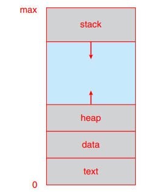
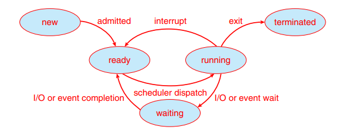

# Process

프로세스는 실행 중인 프로그램이다. 

[프로세스가 생성되는 과정](./Structure.md#Linker&Loader)

프로세스란?

## 메모리 구조

- 스택
- 힙
- 데이터
- 텍스트
- 

## 프로세스 상태

- 생성(new): 프로세스가 생성 중
- 실행(running): CPU를 할당받아 명령어를 실행 중인 상태
- 대기(waiting): 이벤트(ex. I/O)가 일어나기를 기다리는 상태
- 준비(ready): 프로세스가 CPU를 할당받기 위해 기다리는 상태
- 종료(terminated): 프로세스 실행이 종료됨

프로세스는 실행되면서 상태가 변한다. 실행, 대기, 준비 상태에서는 각각의 큐를 두어 프로세스들을 관리한다.

## PCB

## 컨텍스트 스위칭

# IPC

IPC가 뭔지, 왜 쓰는지

- 공유메모리 모델
  - 공유 메모리
- 메세지 전달 모델
  - 파이프
  - 메세지큐
  - 소켓

# Thread

쓰레드란? 이거 왜 쓰는지?

프로세스랑 차이점

멀티스레딩

스레드풀

# 스케줄링

스케줄링이란

주요 알고리즘 소개

# Synchroniztion

동기화란, 동기화가 필요한 이유

레이스 컨디션

임계 구역

도구들 -> 세마포어 뮤텍스 모니터

### 데드락

원인

해결ㅂ

