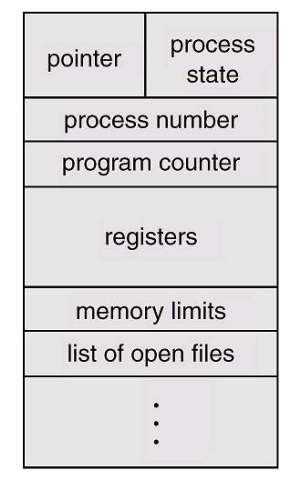
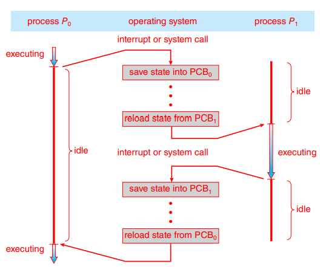

# Process

프로세스는 실행 중인 프로그램이다. 또한 CPU 스케줄링의 단위이기도 하다. 각각의 프로세스는 다른 프로세스의 메모리에 접근할 수 없다.

프로세스의 현재 활동 상태는 PC(Program counter)값과 레지스터의 내용으로 표현된다.

> 작업(Job)
>
> 이는 과거의 배치 시스템에서 사용되던 용어이다. 현대에는 프로세스라는 용어를 사용한다. 하지만 과거의 이론이 정립되던 시기에 작업이라는 용어를 사용했기 때문에 용어를 혼용해서 사용하는 경우도 있다.

## 메모리 구조

- 스택
  - 함수를 호출할 때 사용되는 메모리
  - 매개변수, 지역변수, 복귀 주소 등이 포함된 [activation record](../../school/concepts-of-programming-languages/chapter 10.md)를 스택에 저장
- 힙
  - 실행 중에 동적으로 할당되는 메모리
  - new 키워드, malloc() 등으로 생성되는 변수들을 저장
- 데이터
  - BSS와 데이터 영역으로 나뉨
  - BSS: 초기화되지 않은 전역 변수 저장
  - 데이터: 초기화된 전역 변수 저장

- 텍스트
  - 실행 코드 저장

텍스트와 데이터 영역은 크기가 고정되어 있다. 하지만 스택과 힙은 프로그램 실행 중에 크기가 동적으로 변한다.

한 프로세스는 다른 프로세스의 메모리 영역에 접근할 수 없다.

## 프로세스 상태

- 생성(new): 프로세스가 생성 중
- 실행(running): CPU를 할당받아 명령어를 실행 중인 상태
- 대기(waiting): 이벤트(ex. I/O)가 일어나기를 기다리는 상태
- 준비(ready): 프로세스가 CPU를 할당받기 위해 기다리는 상태
- 종료(terminated): 프로세스 실행이 종료됨

프로세스는 실행되면서 상태가 변한다. 실행, 대기, 준비 상태에서는 각각의 큐를 두어 프로세스들을 관리한다.

## PCB

프로세스는 **PCB**(Process control block)에 의해 표현된다. PCB는 OS가 프로세스에 대한 정보를 저장해놓는 블록이다. 프로세스를 시작시키는데 필요한 모든 정보를 저장한다. 

- 프로세스 상태
- PC 값
- CPU 레지스터
  - 프로세스가 다시 스케줄링 될 때 실행 상태를 복원하기 위해 저장
- CPU 스케줄링 정보
- 메모리 관리 정보
- 회계 정보
- 입출력 상태 정보

## Context switching

프로세스가 다시 스케줄링 되거나 인터럽트를 처리한 후에 원래의 프로세스의 흐름으로 돌아올 때, 실행 중이던 맥락을 복원해야 한다. 실행 중인 프로세스를 중단시키고 다른 프로세스의 맥락을 복구하는 작업을 **Context switching**이라고 한다. 현재 실행중이던 프로세스의 정보를 PCB에 저장하고 실행해야할 프로세스의 정보를 PCB에서 가져온다. 이 과정 중에는 CPU가 다른 일을 하지 못하기 때문에, context switching 시간은 오버헤드로 작용하며 하드웨어의 지원에 따라 달라진다.

# IPC

멀티 코어 시스템에서 하나의 큰 작업을 처리한다면, 그것을 여러 작업으로 쪼개서 병렬로 실행하도록 하면 더 빨리 작업을 완료할 수 있다. 또한 각각의 작업들을 모듈로 구성해 분리해서 처리할 수도 있다. 그러기 위해서 쪼갠 작업끼리 통신할 수 있는 방법이 필요하다

**IPC**(Inter-process communication)는 프로세스 간 데이터를 교환할 수 있는 기법이다. IPC는 크게 공유 메모리, 메세지 전달 2가지 방식으로 나뉜다

## Shared memory

- 프로세스들끼리 공유하는 메모리 영역을 통해 데이터를 교환하는 방식 (read & write)
- 프로세스들의 주소 공간의 일부를 공유 메모리로 설정해서 프로세스에서 바로 접근 가능
- 공유 메모리가 일단 구축되면 커널을 거치지 않고 통신 가능
  - 메시지 전달 방식에 비해 빠르게 통신 가능
  - 커널을 통하지 않기 때문에 동기화가 되지 않음, 부가적인 방식으로 동기화를 구현해야 함

## Message passing

- 프로세스 사이에서 메세지를 전달해 데이터를 교환하는 방식 (send & receive)
- 시스템 콜을 사용하기 때문에 커널을 거쳐야 함
  - 공유 메모리 방식에 비해 느림
  - 커널이 동기화를 제공하기 때문에 신경쓸 필요 없음
- 메세지 큐, 소켓, 파이프 등이 있음

### Message queue

### socket

### pipe

- 

# Thread

쓰레드란? 이거 왜 쓰는지?

프로세스랑 차이점

멀티스레딩

스레드풀

# 스케줄링

스케줄링이란

주요 알고리즘 소개

# Synchroniztion

동기화란, 동기화가 필요한 이유

레이스 컨디션

임계 구역

도구들 -> 세마포어 뮤텍스 모니터

### 데드락

원인

해결ㅂ

