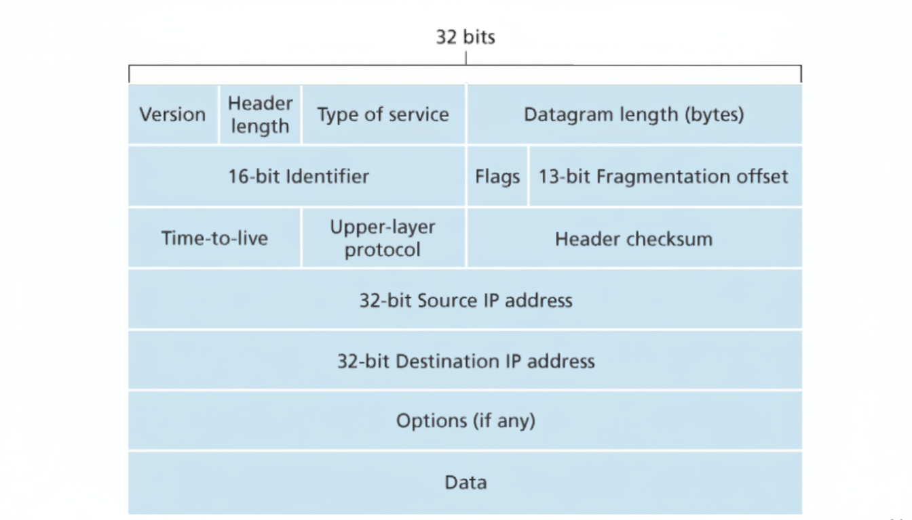
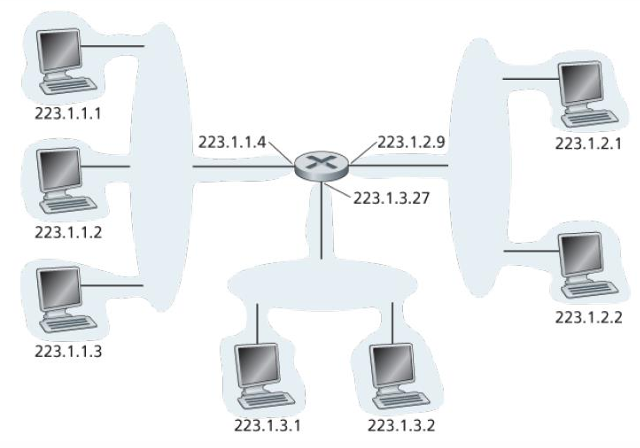

# network layer

## IPv4 헤더 구조

- 버전
  - IP 프로토콜의 버전을 명시함. IPv4, IPv6
- 헤더 길이
  - 실제 페이로드가 시작하는 곳을 결정함. 가변 길이의 옵션이 있기 때문에 필요한 값이다.
  - 옵션이 없으면 20 바이트이다.
- 서비스 타입
  - 패킷의 종류와 우선순위를 구별해서 QOS를 관리할 때 사용되는 값이다.	
- 데이터 그램 길이
  - IP 패킷의 전체 길이. 바이트 단위이다.
- 식별자, 플래그, 단편화 오프셋
  - 단편화와 관련된 필드들. 추후 설명
- TTL
  - 라우터를 지나갈 때마다 하나씩 감소하고 0이 되면 패킷을 버린다. 패킷의 수명을 정한 값이다.
- 프로토콜
  - 전송 계층의 특정 프로토콜을 명시한다. 네트워크 계층과 전송 계층을 연결하는 역할을 한다.
- 헤더 체크섬
  - 패킷의 비트 오류를 탐지하는데 사용되는 값. 
- 출발지와 목적지 IP 주소
  - 말 그대로 출발지와 목적지의 IP 주소를 저장하는 공간
- 옵션
  - 헤더가 가변 길이로 변하는 문제와 옵션에 따라 라우터에서의 처리 시간이 크게 달라지는 문제 때문에 거의 사용하지 않는다.
  - IPv6에서는 포함되지 않는 값이다.
- 데이터(페이로드)
  - 실제로 전달하려는 데이터. 주로 전송 계층의 세그먼트가 해당되며, ICMP 메세지와 같은 다른 유형의 데이터일 수도 있다.

## 단편화

링크 계층 프레임이 전달할 수 있는 최대 데이터 양을 **MTU(maximun transmission unit)**라고 한다. 예를 들어 이더넷에서는 1500바이트이다. IP 패킷은 링크 계층을 통해 전달되기 때문에 그 크기에 있어서 MTU의 영향을 받는다. 

어떤 라우터에 연결된 링크들이 서로 다른 MTU를 가진 링크 계층 프로토콜을 사용한다고 가정해보자. 만약 들어온 패킷의 길이가 전송하려는 링크 계층 프로토콜의 MTU보다 크다면 어떻게 될까? 해결법은 패킷을 잘게 쪼개서 전송하는 것이다. 쪼개진 패킷의 조각을 **fragment**라고 한다. 조각들은 목적지 전송 계층에 도달하기 전에 재결합되어야 한다. 패킷들은 라우터가 아닌 목적지에서 재결합된다. 재결합 하기 위해서 IP 헤더에 있는 **식별자, 플래그, 단편화 오프셋** 필드를 사용한다. IPv6에서는 단편화를 허용하지 않는다.

- 식별자
  - 단편화된 패킷이 원래 하나의 패킷이었다것을 알려주는 역할이다. 
  - 하나의 패킷이 단편화되면 그 조각들은 모두 같은 식별자를 갖는다. 
- 플래그
  - 조각들은 그 다음 조각이 있을 경우 플래그 중 MF 비트가 값이 1로 설정되며, 마지막 조각인 경우 0으로 설정된다. 
- 오프셋
  - 올바른 순서로 재결합하기 위해 사용되는 값이다. 
  - 원본 패킷의 시작점으로부터 얼마만큼 떨어져 있는지 나타낸다.
  - 첫 조각은 0이며, 그 다음 조각은 보낸 총 데이터 양(byte 단위)을 8로 나눈 값으로 설정된다.

## IPv4 주소 체계

먼저 IP 주소가 어디에 할당되는지 알아야 한다. IP 주소는 호스트/라우터와 물리적 링크 사이의 경계인 **인터페이스**에 할당된다. 호스트는 보통 1개의 인터페이스를 가지고 라우터는 2개 이상의 인터페이스를 가진다.

**IPv4** 주소는 32비트의 길이를 가진다. 대략 40억개의 주소를 사용할 수 있고 바이트 단위로 점을 찍어서 10진수로 표시해 사용한다.

위 그림에서 왼쪽의 라우터 인터페이스와 3개의 호스트는 223.1.1.x 형식의 주소를 갖는다. 이 라우터와 호스트들은 **서브넷**을 구성한다. IP 주소 체계는 이 서브넷에 223.1.1.0/24라는 주소를 할당한다. /24는 **서브넷 마스크**이다. IP 주소는 네트워크 ID와 호스트 ID로 나뉜다. 서브넷 마스크는 어디까지가 네트워크 부분인지를 나타내준다. /24라는 서브넷 마스크는 앞의 24비트가 네트워크 부분이고, 뒤의 8비트가 호스트 부분이라는 것을 나타낸다. 만약 이 서브넷에 새 호스트가 추가된다면 223.1.1.x 형식의 주소가 부여되어야 한다. 

위 그림에서는 서브넷이 3개 존재한다. 왼쪽의 223.1.1.0/24, 오른쪽의 223.1.2.0/24, 아래의 223.1.3.0/24.

서브넷의 첫번째 주소는 네트워크 주소로 사용되고 마지막 주소는 브로드캐스트 주소로 사용된다. 서브넷 마스크가 /x라면 하면 호스트에 할당될 수 있는 주소는 $2^{32 - x} - 2$개다. 왼쪽 서브넷의 네트워크 주소는 223.1.1.0이고 브로드캐스트 주소는 223.1.1.255이다. 

서브넷으로 나뉜 네트워크는 각각이 독립적인 네트워크다. 하나의 네트워크를 독립적인 여러개의 네트워크로 분리함으로써 얻는 장점이 존재한다.

- 성능 향상: 브로드캐스트는 같은 네트워크 내부에서만 전송된다. 네트워크를 분리하면 브로드캐스트 도메인도 같이 분리되기 때문에 전체 네트워크 트래픽이 감소하는 효과가 있다.
- 보안 강화: 하나의 네트워크가 공격받거나 문제가 생겨도 네트워크가 분리되어 있기 때문에 다른 네트워크는 보호받을 수 있다.

과거에는 서브넷을 나눌 때 클래스를 기반으로 나눴다. 클래스는 A, B, C 클래스로 나뉘었으며 순서대로 /8, /16, /24의 서브넷 마스크를 가진다. 각 클래스는 최상위 비트를 구분 비트로 사용하며, A는 0, B는 10, C는 110이다. 가질 수 있는 주소 범위는 다음과 같다.

- A 클래스: 0.0.0.0 ~ 127.255.255.255
- B 클래스: 128.0.0.0 ~ 191.255.255.255
- C 클래스: 192.0.0.0 ~ 223.255.255.255

클래스 기반 주소 체계에는 IP 주소가 낭비된다는 문제가 있었다. 예를 들어 구축하려는 네트워크에 호스트가 300개 정도 있다고 해보자. C 클래스(254개)를 사용하기에는 주소가 모자라다. 어쩔 수 없이 B 클래스(65534개)를 할당받으면 6만개가 넘는 IP 주소의 낭비가 생긴다. 이는 엄청나게 비효율적이고, IP 주소의 고갈을 가속화시켰다.

이를 해결하기 위해서 **CIDR(Classless Interdomain Routing)**라는 방식을 사용한다. 앞서 설명했듯 IP 주소를 네트워크 부분과 호스트 부분으로 나누어 a.b.c.d/x 형태로 표시한다. 클래스 방식과 다른 점은 x가 고정되어 있지 않다는 점이다. x 값을 원하는 호스트의 개수에 맞춰서 사용할 수 있기 때문에 IP 주소가 낭비되는 일을 방지할 수 있다.

### DHCP

**DCHP(Dynamic Host Configuration Protocol)**는 호스트에 동적으로 IP 주소를 할당해주는 프로토콜이다. DHCP를 이용하면 네트워크에 접속하는 호스트에게 하나하나 수동으로 주소를 할당해 줄 필요가 없어진다.

DCHP 프로토콜의 과정은 다음과 같다

1. DCHP 발견
   - 네트워크에 처음 접속한 호스트는 출발지 주소를 0.0.0.0으로 하고 DHCP 발견 메세지를 브로드캐스트 한다. 목적지 포트는 67번을 사용한다.
2. DHCP 제공
   - 메세지를 수신한 DHCP 서버가 할당할 IP 주소를 담아서 다시 브로드캐스트 한다.
3. DHCP 요청
   - 호스트는 여러개의 DHCP 서버 중 하나를 선택해 해당 주소를 사용하겠다고 알린다
4. DHCP ACK
   - 서버는 확인 메세지를 전송한다.

## NAT

**공인 IP**는 전 세계적으로 고유한 IP 주소다. 공인 IP가 할당된 기기는 어디서나 접근이 가능하다.

**사설 IP**는 고유하지 않은 IP 주소다. 로컬 네트워크에서만 사용되는 IP이며 다른 네트워크에도 중복된 IP 주소가 있을 수 있다. 다른 네트워크에서도 같은 IP를 사용할 수 있기 때문에 글로벌 인터넷에서는 사용할 수 없다. 오로지 주어진 로컬 네트워크 내부에서만 사용 가능한 주소이다.

사설 IP로 지정된 대역은 다음과 같다

- 10.0.0.0 ~ 10.255.255.255
- 172.16.0.0 ~ 172.31.255.255
- 192.168.0.0 ~ 192.168.255.255

**NAT**(Network Address Translation)은 사설 IP와 공인 IP사이를 변환하는 방법이다. 내부 네트워크는 사설 IP를 할당받고, NAT 기능이 있는 라우터의 WAN 인터페이스에 공인 IP를 할당받는다.

그냥 모든 호스트에 공인 IP주소를 할당받아서 사용하지 않고 이런 번거로운 과정을 거치는 이유가 있다. 

- IP 주소를 절약할 수 있다.
  - IPv4 주소가 부족한 상태이기 때문에 사설 IP를 사용하여 IP 주소의 사용량을 감소시킬 수 있다.
- 외부에 알리지 않고도 로컬 네트워크의 IP 주소를 변경할 수 있다
- 로컬 네트워크의 IP를 변경하지 않고 ISP를 변경할 수 있다.
- 외부에서 호스트에 직접 접근할 수 없기 때문에 보안상의 이점이 있다.

변환 과정은 다음과 같다.

1. 내부 호스트가 외부 서버에 요청을 보낸다. 
   - source: 10.0.0.1:3345, dest: 128.119.40.186:80

2. 라우터는 패킷을 받아서 source IP와 포트를 변경하고 NAT 변환 테이블에 기록한 후에 목적지로 전송한다.
   - IP는 라우터의 WAN 인터페이스의 주소, 포트는 새로운 번호 선택.

   - 포트 번호로 식별하기 때문에 NAT 변환 테이블에 존재하지 않는 새로운 번호를 선택해야 함.

   - | WAN side addr    | LAN side addr |
     | ---------------- | ------------- |
     | 138.76.29.7:5001 | 10.0.0.1:3345 |

3. 서버는 패킷를 받아서 처리한 후 응답한다.
   - source: 128.119.40.186:80, dest: 138.76.29.7:5001

4. 라우터는 응답의 목적지 IP와 포트를 NAT 변환 테이블에서 찾고, 해당되는 LAN 주소로 변환한다.
   - source: 128.119.40.186:80, dest: 10.0.0.1:3345

우리가 흔히 사용하는 공유기에 NAT 기능이 탑재되어 있다. 공유기는 공인 IP를 할당받고, 공유기에 접속한 기기들에게 사설 IP를 부여한다. 그리고 외부와 통신할 수 있도록 NAT를 통해 주소를 변환시켜준다.
