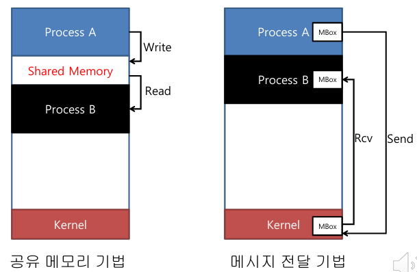
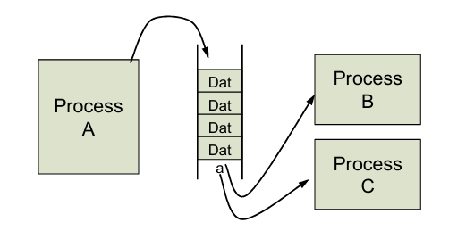
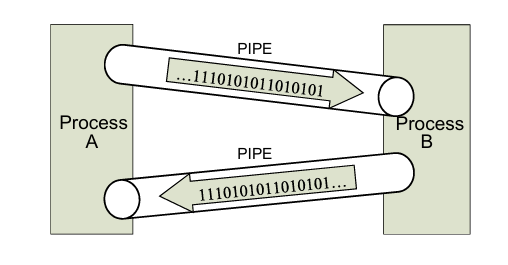

# IPC

멀티 코어 시스템에서 하나의 큰 작업을 처리한다면, 그것을 여러 작업으로 쪼개서 병렬로 실행하도록 하면 더 빨리 작업을 완료할 수 있다. 또한 각각의 작업들을 모듈로 구성해 분리해서 처리할 수도 있다. 그러기 위해서 쪼갠 작업끼리 통신할 수 있는 방법이 필요하다

**IPC**(Inter-process communication)는 프로세스 간 데이터를 교환할 수 있는 기법이다. IPC는 크게 공유 메모리, 메세지 전달 2가지 방식으로 나뉜다.

## Shared memory

- 프로세스들끼리 공유하는 메모리 영역을 통해 데이터를 교환하는 방식 (read & write)
- 프로세스들의 주소 공간의 일부를 공유 메모리로 설정해서 프로세스에서 바로 접근 가능함
  - 메시지 전달 방식에 비해 빠르게 통신 가능
- 공유 메모리를 생성할 때만 시스템 콜을 호출하고, 일단 구축되면 커널을 거치지 않고 통신 가능
  - 커널을 통하지 않기 때문에 동기화가 되지 않음
  - 따라서 세마포어나 뮤텍스같은 부가적인 방식으로 동기화를 구현해야 함

## Message passing

- 프로세스 사이에서 메세지를 전달해 데이터를 교환하는 방식 (send & receive)
- 시스템 콜을 사용하기 때문에 커널을 거쳐야 함
  - 공유 메모리 방식에 비해 느림
  - 커널이 동기화를 제공하기 때문에 신경쓸 필요 없음
- 메세지 큐, 소켓, 파이프 등이 있음

### Message queue

- 큐를 통해 메세지 단위로 통신
- 메세지의 형태는 통신하는 프로세스간에 미리 정해두어야 함
  - 형태는 사용자가 정의해야 함
- 메세지 큐의 키를 알고 있는 모든 프로세스가 접근 가능

### Socket

- 같은 컴퓨터 뿐만 아니라 네트워크에 연결된 다른 프로세스끼리도 통신할 수 있도록 만들어짐
- 통신할 프로세스에 포트 번호를 부여해서 식별함
  - 네트워크에 연결된 경우에는 IP + 포트 조합으로 식별
- 클라이언트 서버 구조 사용
- IP 주소와 포트 번호를 이용해서 통신
- 연결 지향인 TCP와 비연결 지향인 UDP가 있음

### Pipe

- 보내진 순서대로 처리하는 FIFO 방식
- 익명 파이프와 명명된 파이프로 나뉨
- 익명 파이프
  - 데이터가 한쪽으로만 이동하는 단방향 통신 방법
    - 양방향이 필요하면 2개 생성해야 함

  - 파이프를 생성한 프로세스에서만 사용 가능
    - 주로 fork로 생성된 부모-자식 프로세스 관계에서만 사용함

  - 프로세스 종료시 소멸됨

- 명명된 파이프
  - 양방향 통신 지원
    - UNIX FIFO에서는 반이중, 윈도우에서는 전이중 통신 지원
  - 여러 프로세스에서 사용 가능
  - 프로세스가 종료되더라도 계속 존재함

