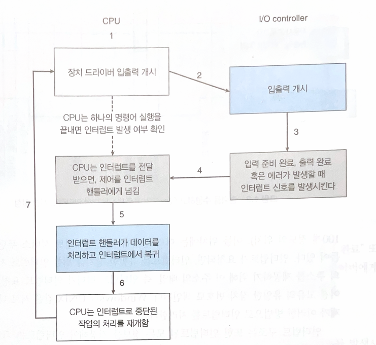

# Interrupt

**인터럽트**는 비동기적 이벤트를 처리하기 위한 기법이다. 장치 컨트롤러 또는 하드웨어 오류로 인해 인터럽트가 발생한다.

CPU에는 **인터럽트 요청 라인**이라는 선이 존재한다. 명령어가 실행될 때마다 CPU가 이 선을 감지한다. 라인에 신호가 들어오면 CPU는 인터럽트 번호를 사용해서 인터럽트를 처리하는 **인터럽트 핸들러 루틴**으로 점프해서 인터럽트를 처리한다. 

인터럽트를 처리하고 CPU가 중단된 작업으로 다시 돌아올 수 있어야 한다. 때문에 인터럽트를 처리하기 전에 이전의 상태를 저장해놓아야 하며, 원래의 작업으로 복귀하기 전에 상태를 복원해야 한다. 인터럽트 핸들러는 레지스터의 값을 저장해 두었다가 다시 복원해서 이전의 실행 흐름으로 복귀할 수 있도록 한다.

다음의 그림은 과정을 요약한 그림이다.

인터럽트는 매우 자주 발생하기 때문에 빠르게 처리되어야 한다. 그러기 위해서 실행되어야 하는 루틴에 대한 포인터를 저장해놓은 테이블을 이용한다. 이를 **인터럽트 벡터**라고 한다. 인터럽트 번호가 인터럽트 벡터의 테이블 오프셋으로 사용된다. 인터럽트 벡터의 주소 개수보다 더 많은 장치가 존재하기 때문에 **인터럽트 체인**을 이용한다. 하나의 주소에 여러개의 인터럽트 핸들러가 연결 리스트 형태로 이어져 있고, 인터럽트가 호출되면 핸들러들을 하나씩 순회하면서 알맞은 핸들러를 찾는다.

인터럽트에는 우선 순위가 존재한다. 우선순위를 구현하기 위해 인터럽트 라인을 2가지 종류로 구성한다. 첫번째는 마스크 불가 인터럽트다. 회복 불가능한 메모리 오류과 같은 이벤트에 사용된다. 두번째는 마스크 가능 인터럽트다. 이 라인은 장치 컨트롤러가 사용하며, 인터럽트로 방해받지 않아야 하는 작업을 수행중일 때 끌 수 있다.

인터럽트는 하드웨어 인터럽트와 소트프웨어 인터럽트로 나뉜다. **하드웨어 인터럽트**는 말 그대로 하드웨어에 의해서 일어난다. I/O 장치나 타이머 등에 의해서 발생된다. 비동기적으로 발생한다는 특징이 있다. **소프트웨어 인터럽트**는 현재 실행중인 소프트웨어에 의해 발생한다. 동기적으로 발생하며 트랩이라고도 한다. divide-by-zero, 페이지 폴트, 시스템 콜 호출 등의 상황에서 발생한다.

> csapp에서는 크게 예외 상황이 존재하고, 예외의 종류로 interrupt, trap, falut, abort 4가지가 있다고 설명한다
>
> |           | 이유                                               | 동기/비동기 | 리턴                          |
> | --------- | -------------------------------------------------- | ----------- | ----------------------------- |
> | interrupt | I/O 장치에서 발생                                  | 비동기      | 항상 다음 명령어로 리턴       |
> | trap      | 의도적인 예외 발생, 주로 시스템 콜 호출에서 발생함 | 동기        | 항상 다음 명령어로 리턴       |
> | fault     | 회복 가능한 에러가 발생했을 때(페이지 폴트 등)     | 동기        | 현재 실행중이던 명령어로 리턴 |
> | abort     | 회복 불가능한 에러                                 | 동기        | 리턴하지 않고 프로그램 종료   |
>
> 차이를 알아보니 운영체제 관점에서 보면 하드웨어 인터럽트, 소프트웨어 인터럽트로 나뉘고, CPU 아키텍쳐적 관점에서 보면 위의 4가지로 나뉜다고 한다. 관점의 차이이기 때문에 뭐가 맞고 틀린건 없는듯하다.

