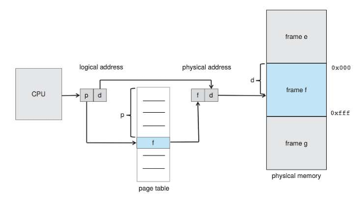
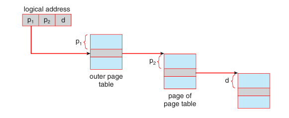
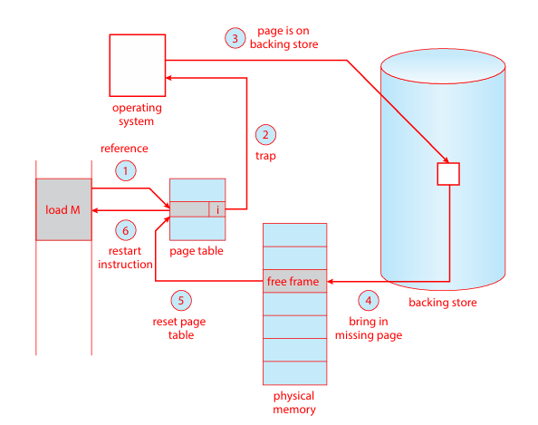

# Memory

메모리는 프로그램 실행에 필요한 정보(명령어, 데이터 등)를 저장하는 하드웨어다. 메모리에는 바이트 단위로 주소가 할당된다.

메모리의 주소에는 물리 주소와 가상 주소가 있다

- 물리 주소
  - 실제 메인 메모리에 접근할 때 사용되는 주소
- 가상 주소
  - 프로세스 관점에서 사용하는 주소
  - CPU는 가상 주소를 사용함
  - 실제 메모리에 접근하기 위해서 가상 주소를 물리 주소로 변환시켜주는 **MMU**가 필요

> MMU
>
> MMU는 가상 주소를 물리 주소로 변환시켜주는 하드웨어다. CPU가 가상 주소로 접근하려하면, MMU가 그 주소를 실제 물리 주소로 변환해서 메모리에 접근할 수 있다. 

가상 메모리는 프로세스가 수행되기 위해서 프로그램의 모든 부분이 메모리에 올라올 필요가 없다는 점에서 출발했다. 현재 실행되고 있는 부분만 실제 메모리에 있으면 프로세스를 실행할 수 있다. 이렇게 되면 프로그램은 매우 큰 가상 주소 공간을 가정해서 프로그램을 만들 수 있기 때문에 물리 메모리 크기에 제약을 받지 않게 된다. 더 많은 프로세스를 동시에 실행시킬 수도 있고, 프로그램을 메모리에 올리고 스왑하는데 필요한 I/O 횟수도 감소해서 더 빨리 실행시킬 수 있다. 또한 공통적으로 사용하는 라이브러리가 차지하는 물리 메모리 공간을 공유해서 사용할 수도 있다

**가상 메모리**는 물리 메모리를 매우 크고 균일한 저장장소 배열로 추상화한다. **페이징** 기술을 사용해 메모리를 나누고 현재 사용중이지 않은 페이지는 디스크에 저장해둔다. 가상 주소와 물리 주소를 연결시키는 **페이지 테이블**을 통해 실제 메모리에 접근한다.

## Paging

**페이징**은 주소 공간을 일정한 크기로 나누어서 관리하는 방법이다. 물리 메모리의 한 블럭을 **프레임**이라고 하고, 가상 메모리의 한 블럭을 **페이지**라고 한다. 이 둘은 서로 크기가 같다. 하나의 페이지는 보통 4KB로 나뉜다. 페이지가 프레임을 할당받으면 물리 메모리에 위치하게 되며, 할당받지 못하면 디스크와 같은 저장장치에 저장된다.

CPU가 사용하는 가상 주소는 **페이지 번호**와 **페이지 오프셋**으로 이루어져 있다. 페이지 번호는 페이지 자체를 식별하는 번호이고, 페이지 오프셋은 페이지 내부에서의 위치를 결정하는데 사용되는 값이다. 프레임의 시작 주소와 페이지 오프셋의 값을 조합하면 실제 메모리의 주소를 얻을 수 있다. 32비트 시스템에서 페이지의 크기가 4KB이라고 가정하면 페이지 번호는 20비트, 페이지 오프셋은 12비트가 사용된다.

### Page table

**페이지 테이블**은 가상 주소와 물리 주소를 연결시키는 역할을 한다. 각 프로세스마다 하나의 페이지 테이블을 가지고 있다. 페이지 테이블은 페이지 번호를 인덱스로 가지며, 해당 페이지에 할당된 물리 메모리의 주소가 저장된다. 페이지 테이블은 메인 메모리에 저장되고 그 주소를 PTBR(Page-table base register)이라는 레지스터에 저장하는 방식으로 구현된다.

MMU는 다음과 같은 과정을 거쳐 실제 접근할 메모리의 주소를 계산한다.

1. 페이지 번호를 바탕으로 페이지 테이블에 접근한다.(p 값으로 찾음)
2. 해당하는 프레임의 번호를 찾는다(f 값)
3. 가상 주소의 페이지 번호를 프레임의 것으로 바꾼다.(f + d)

페이지 테이블의 레코드는 **PTE**(Page table entry)라고 한다. PTE에는 할당된 프레임의 시작 주소와 플래그 비트들이 포함되어 있다. 주요 플래그 비트는 다음과 같다.

- accessed bit
  - 페이지에 접근이 있었는지를 나타냄. 페이지 교체에 사용
- dirty bit
  - 데이터의 변경이 있었는지를 나타냄. 
- valid bit
  - 페이지에 할당된 프레임이 있는지를 나타냄.
- read/write bit
  - 읽기/쓰기에 대한 권한을 나타냄

#### Multi-level page table

32비트 시스템에 페이지 크기가 4KB라고 해보자. 페이지 테이블의 크기는 $2^{20}$개, PTE는 4바이트이므로 페이지 테이블의 총 크기는 4MB이다. 모든 프로세스가 4MB 크기의 페이지 테이블을 메모리에 올려놓으면 너무 큰 용량을 차지해 메모리의 낭비가 심해진다. 이를 해결하기 위해서 멀티 레벨 페이지 테이블을 사용한다

멀티 레벨 페이지 테이블은 페이지 테이블을 페이징해서 관리하는 방법이다. 페이지 번호를 두개로 나눈다. 바깥에 페이지 테이블을 하나 더 만들고, 바깥 페이지 테이블이 안쪽 페이지 테이블을 가리키게 한다. 그리고 메모리에는 바깥 테이블만 저장해놓고 안쪽 테이블을 페이징 처리한다. 이렇게 하면 바깥 테이블의 크기인 4KB($2^{10}$*4 바이트)만 메모리에 상주하고, 안쪽 테이블은 페이지로 나뉘어져 있기 때문에 사용할 때만 메모리에 올리면 된다. 가상 주소 공간의 모든 부분을 전부 사용하지는 않기 때문에 메모리를 절약할 수 있다.

실제 64비트 시스템에서는 4레벨 페이지 테이블을 사용한다. 64비트 주소 공간은 너무나도 크기 때문에 48비트만 사용하며, 페이지 테이블의 인덱스는 9비트씩을 사용한다.

### TLB

페이지 테이블을 통해 메모리에 접근한다면 항상 2번의 메모리 접근이 발생한다. 페이지 테이블에 1번 접근하고, 다시 물리 메모리의 데이터에 1번. 여러번 접근하기 때문에 메모리에 접근하는 속도가 느려진다. 

이를 해결하기 위해서 **TLB**(Translation look-aside buffers)라는 하드웨어 캐시가 사용된다.

TLB는 이전에 사용된 PTE를 저장해놓는다. 일종의 캐시 메모리이기 때문에 유사하게 작동한다. CPU가 가상 주소를 생성하면 MMU가 먼저 TLB에 캐싱된 데이터가 있는지 확인한다. 있다면(TLB hit) 바로 물리 주소를 알 수 있다. 없다면(TLB miss) 페이지 테이블에 접근해서 물리 주소를 알아내야 한다. 그리고 찾은 값을 TLB에 추가해서 이후에 더 빨리 찾을 수 있도록 한다.

### Page falut

모든 페이지를 메모리에 올려놓지 않는다. 필요하지 않은 페이지는 메모리에 올라가지 않고 어떤 페이지가 필요할 때 메모리에 올리며 이를 **요구 페이징**(Demand paging)이라고 한다. 프로세스의 전체 페이지를 물리 메모리에 올리지 않기 때문에 물리 메모리를 절약할 수 있다.

이를 구현하기 위해서 페이지 테이블의 valid 비트를 사용한다. vaild 비트가 유효하다면 해당 페이지는 물리 메모리에 할당되어 있다. 유효하지 않다면 물리 메모리에 할당되지 않고 보조 저장장치에 저장되어 있다.

만약 유효하지 않은 페이지, 즉 물리 메모리에 올라가지 않은 페이지를 참조하려고 하면 어떻게 될까? 그러면 **페이지 폴트**가 발생하며, 이는 트랩의 일종이기 때문에 페이지 폴트 핸들러가 실행된다. 핸들러가 처리하는 내용은 다음과 같다

1. 새 프레임을 할당받는다.
2. 보조 저장장치에서 페이지를 새로 할당받은 프레임에 적재한다.
3. 페이지 테이블을 올바르게 수정한다.
4. 중단되었던 명령어를 다시 실행한다.

> Copy-on-write
>
> Copy-on-write는 fork로 새 프로세스 생성 시, 부모 프로세스가 사용하던 페이지들을 자식 프로세스에게 바로 복사해주는 것이 아닌 write 작업이 진행됐을 때만 복사해주는 방식이다. 새 프로젝트를 생성하면 곧바로 exec로 다른 프로그램을 불러오게 되는데, 만약 생성하자마자 페이지들을 복사한다면 바로 쓸모가 없어지게 된다. 이런 비효율을 막고자 새 프로세스가 생성되면 일단 부모와 자식 프로세스가 같은 페이지들을 사용하고, 추후에 쓰기 작업이 발생했을 때 그 페이지만 복사한다.

>  Thrashing
>
> 프레임의 개수가 모자라다면 **스레싱**(Thrashing)이 발생한다. 스레싱은 페이지 폴트를 처리하는 시간이 실제 프로세스의 실행 시간보다 더 긴 상황을 말한다.

## Page replacement

요구 페이징을 사용해도 여러 프로세스가 동시에 실행되는 시스템에서는 모든 페이지의 수보다 프레임의 수가 훨씬 적기 때문에 프레임이 모자라게 된다. 유저 프로세스의 수가 더 늘어나게 되면 **메모리 과할당** 문제가 발생한다. 

만약 페이지 폴트가 발생해서 새 프레임을 할당받아야 하는데 더 이상 할당받을 프레임이 없다면 문제가 생기게 된다. 해결하려면 프레임을 하나 골라서 비워버리고 새 페이지를 올려야 한다. 이 과정을 페이지 교체라고 하며 자세한 과정은 다음과 같다.

1. 디스크에서 필요한 페이지의 위치를 찾는다
2. 빈 프레임을 찾는다
   1. 있다면 그 프레임을 사용한다
   2. 없다면 적절한 프레임을 골라 디스크에 저장하고 비워버린다(swap)
3. 새 페이지를 프레임에 올린 후 페이지 테이블을 수정한다.

비워버릴 적절한 프레임을 고르는 방법을 **페이지 교체 알고리즘**이라고 한다. 가장 낮은 페이지 폴트 발생 빈도(== 가장 낮은 I/O 작업 횟수)를 가진 알고리즘이 제일 좋은 알고리즘이다.

### FIFO

단순하게 메모리에 올라온지 가장 오래된 페이지를 교체하는 알고리즘이다. 주로 큐를 이용해 구현된다. 가장 간단하기 때문에 이해하기도 쉽고 만들기도 쉽다는 장점이 있지만 성능은 좋지 않기 때문에 잘 사용되지 않는다

### Optimal

가장 이상적인 알고리즘으로 가장 오랫동안 사용되지 않을 페이지를 찾아서 교체하는 알고리즘이다. 하지만 미래를 예측하기란 불가능하기 때문에 실현될 수 없다. 주로 다른 알고리즘과의 비교를 통해 얼마나 그 알고리즘이 뛰어난 성능을 가지고 있는지 판단하는 기준으로 사용된다.

### LRU

가장 오랫동안 참조되지 않은 페이지를 교체하는 알고리즘이다. 주로 counter나 이중 연결 리스트로 구현된 stack을 이용해서 구현한다. Optimal 알고리즘과 유사하며 실제 구현 가능한 알고리즘이지만 참조할때마다 counter나 스택을 갱신해야해서 성능이 좋지 않다.

### LRU 근사

LRU의 성능을 개선하기 위해서 LRU 알고리즘을 근사하는 알고리즘이다.

#### Second-chance(clock)

Clock 알고리즘이라고도 불린다. 기본적으로 FIFO 알고리즘을 사용한다. 페이지에 참조 비트를 추가해서 페이지를 참조할 때마다 1로 변경한다. FIFO 큐를 원형 큐로 구성해 참조 비트가 1이면 넘어가고 0이면 교체 대상으로 삼는다. 넘어간 페이지의 참조 비트는 0으로 설정된다.

#### Enhanced Second-chance(NRU)

clock 알고리즘을 개선한 알고리즘으로 참조 비트에 더해 변경 비트를 추가로 사용한다. 변경 비트는 페이지에 쓰기 작업이 발생했을 때 1로 설정된다. 모든 비트는 주기적으로 0으로 초기화된다. 2비트로 만들어지는 등급이 낮은 등급을 가지면서 제일 먼저 만나는 페이지를 교체한다.

- 참조 0, 변경 0
  - 최근에 사용되지도 변경되지도 않은 경우. 제일 먼저 교체된다
- 참조 0, 변경 1
  - 최근데 사용되지는 않았지만 변경된 경우.
- 참조 1, 변경 0
  - 최근에 사용되었지만 변경되지는 않은 경우
- 참조 1, 변경 1
  - 최근에 사용도 되었고 변경도 된 경우. 제일 나중에 교체된다.
