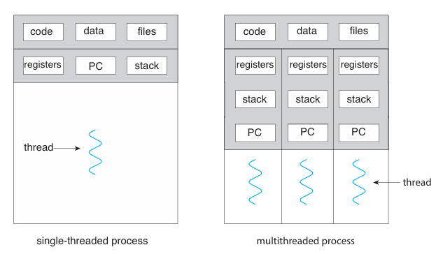

# Thread

**스레드**는 프로세스 내부에서의 실행 흐름이며 가장 작은 실행 단위이다.

전통적인 개념에서 하나의 프로세스에는 하나의 실행 흐름만이 존재했다. 예시로 웹 서버를 생각해보자. 하나의 서버 프로세스가 수 많은 클라이언트의 요청을 받는다. 만약 단일 스레드 프로세스로 작동한다면 클라이언트들은 요청이 처리되기까지 굉장히 오래 기다려야 한다. 해결법으로 새 프로세스를 만들어 요청을 처리하게 할 수 있다. 하지만 프로세스 생성과 생성한 프로세스끼리 통신하기 위해 사용하는 IPC에는 많은 비용이 들어가 비효율적이다. 

이를 해결하기 위해서 스레드를 사용한다. 스레드는 일종의 경량 프로세스이다. 특징은 다음과 같다.

- 하나의 프로세스 안에서 여러개의 스레드가 존재할 수 있음
- 프로세스의 메모리 중 스택을 제외한 모든 영역을 공유
  - 각 스레드는 자신만의 스택과 PC, 레지스터 값을 가짐

- 프로세스의 자원 또한 공유함
- 같은 메모리 영역을 사용하기 때문에 컨텍스트 스위칭 비용이 적음

**멀티 스레딩**은 프로세스 내부의 작업을 여러개의 스레드로 처리하는 기법이다. 장점은 다음과 같다.

- 응답성
  - 프로그램이 시간이 오래 걸리는 부분을 실행하거나 블록되더라도 다른 스레드는 계속 실행 중임
  - 따라서 해당 부분을 다른 스레드에서 처리한다면 사용자는 빠른 응답을 받을 수 있음
- 자원 공유
  - 프로세스의 자원과 메모리를 공유해 더 효율적으로 사용 가능
- 경제성
  - 자원을 공유하기 때문에 생성 시 비용과 컨텍스트 스위칭의 비용이 더 적음
- 규모 적응성
  - 멀티 코어 시스템에서 여러개의 스레드가 다른 프로세서에서 동시에 실행 가능

멀티 스레딩은 프로세스의 자원을 공유하기 때문에 동시성 문제가 발생할 수 있으므로, 동기화 과정을 통해 적절히 제어해야 한다.

---

스레드가 자주 생성되고 제거되는 상황이라면 스레드가 만들어지는 시간이 스레드 실행 시간보다 더 긴 경우가 있을 수 있다. 또한 스레드는 시스템의 자원이기 때문에 무한정 만들 수 없기 때문에 동시 실행 가능한 스레드의 최대 갯수를 정해야 한다.

**스레드 풀**(Thread pool)을 이용하면 이런 문제를 해결할 수 있다. 프로세스를 시작할 때 정해진 수의 스레드를 미리 생성해서 스레드 풀에 할당해 놓는다. 새 스레드가 필요할 때 스레드 풀에서 가져와서 사용하고, 작업이 끝나면 다시 반환한다. 스레드 풀에서 관리할 스레드의 개수는 시스템의 메모리 용량이나 CPU 수 등을 고려하여 결정한다. 장점은 다음과 같다.

- 스레드를 재사용하기 때문에 스레드 생성에 걸리는 시간을 아낄 수 있음
- 너무 많은 스레드 수에 의한 시스템의 부하를 줄일 수 있음
