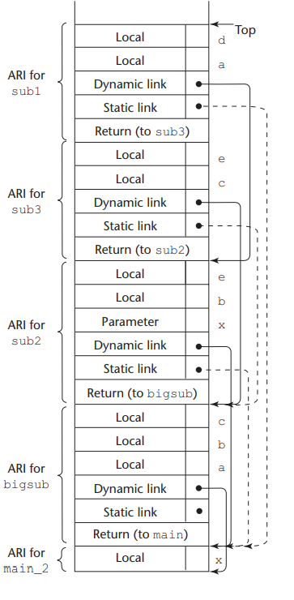

# Implementing Subprogram

subprogram의 호출과 리턴 과정을 **subprogram linkage**라고 한다.

## Implementing simple subprogram

active된 함수의 정보들을 저장하는 공간을 **activation record**라고 한다.  

activation record는 3가지 정보를 저장한다.

- Local variables
- parameters
- return address
  - 호출시의 **PC** 레지스터의 값을 저장

초창기 언어들은 activation record를 static하게 할당했지만 이후의 언어들은 stack에 dynamic하게 할당한다.

## Subprogram with stack-dynamic local variable

stack-dynamic 방식에서의 activation record은 **dynamic link**가 추가된다  
dynamic link는 호출자의 activation record의 시작 주소(stack-base)값을 가지고 있는 **EP** 레지스터의 값을 저장하는 필드이다.  
stack-dynamic 방식을 사용하면서 재귀함수도 지원한다.

함수를 호출할 때 호출자의 EP값을 dynamic link에 저장한다.  
함수가 종료되면 그 값으로 EP값을 다시 설정한다

스택에 존재하는 dynamic link의 모음을 **dynamic chain** 혹은 **call chain**이라고 한다.  
파라미터나 지역 변수에 접근하는 방법으로 현재 EP값에 EP값으로부터 변수가 얼마나 떨어져 있는지를 나타내는 **local offset**을 더하는 방법을 사용한다.  

**recursion**은 함수의 리턴값이 저장되는 functional value 필드가 추가되고, 나머지는 위와 비슷하게 지원한다.

## Nested subprogram

nested 함수는 activation record에 **static link**가 추가된다  
static link는 자기 부모 함수의 EP값을 저장하는 필드이며, static link를 타고 내려가면서 부모 함수의 변수에 접근할 수 있다.  
static link가 이어져서 내려오는 것을 **static chain**이라고 한다  
static link를 얼마나 깊게 타고 내려왔는지를 나타내는 지표를 **static_depth**라고 한다.  
자기 자신의 변수일 경우 static_depth는 0, 부모는 1, 부모의부모는 2와 같은 식이다.  

nested 함수일 경우 변수의 위치를 (depth, offset)으로 나타낼 수 있다.

## Block

하나의 함수 안에서 블록으로 나뉘어졌을 때도 위와 비슷하게 변수들이 할당되고 해제된다.  
함수의 지역 변수가 할당되고 그 위에 블록에서 사용되는 변수들이 할당된다.  
블록을 나오면 변수 할당이 해제된다

## Dynamic scope

dynamic scope를 사용하는 언어에서는 두가지 방식으로 구현한다

- deep access
  - dynamic link를 타고 내려오면서 변수를 찾는 방식
- shallow access
  - 변수별로 그 변수에 접근할 수 있는 함수를 저장